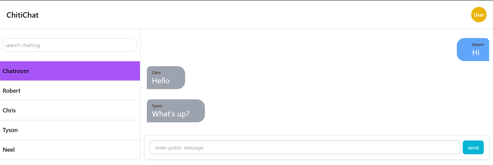
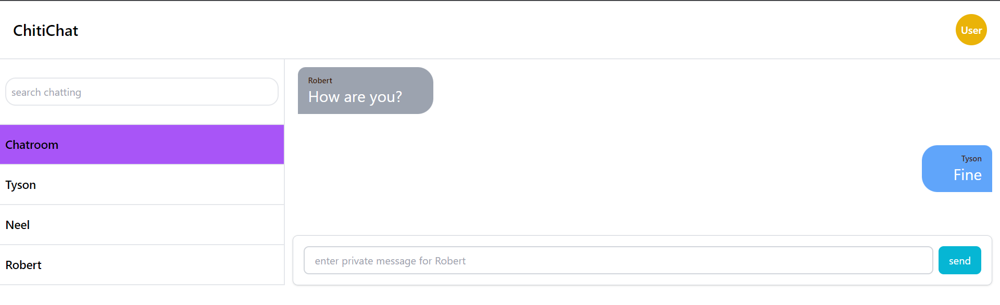

# Real Time Chat Application

Server: - Spring boot Websocket

Client - ReactJS

## ReactJS screen

To start:

### Client

        - npm install (in the chatclient folder)
        - npm run dev

### Server

        - mvn spring-boot:run (in the chatserver folder)
